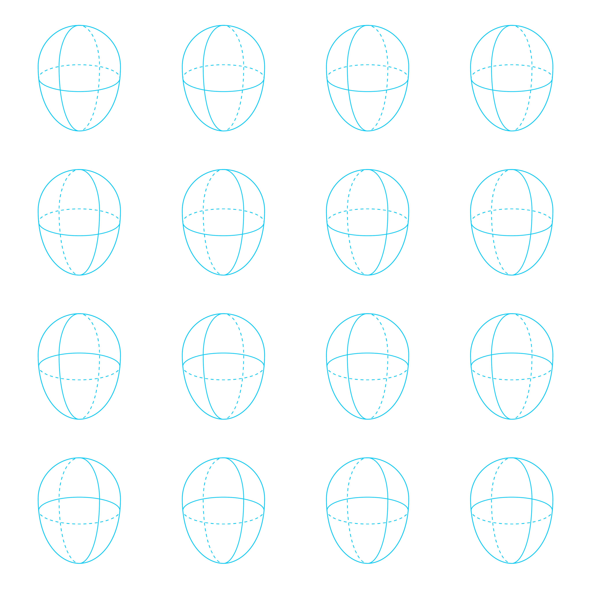

# Drawing Templates

For use in drawing apps on desktop and/or iPad drawing apps, like Photoshop and (my favorite) Paintstorm Studio.

This is a work in progress … More templates coming soon!

## [typography-guidelines](./typography-guidelines/)

## [6x6-spread-bleed@304ppi](./6x6-spread-bleed@304ppi/)

## [8.5x8.5@300ppi-x4](./8.5x8.5@300ppi-x4/)

## [basic-cartoon-character-guidelines-x18](./basic-cartoon-character-guidelines-x18/)

## [basic-cartoon-head-three-quarter-views-x16](./basic-cartoon-head-three-quarter-views-x16/)

## [grid-64x64](./grid-64x64/)

## [loomis-ideal-proportion-male](./loomis-ideal-proportion-male/)

## [square-book-thumbs](./square-book-thumbs/)

## [story-outline](./story-outline/)

