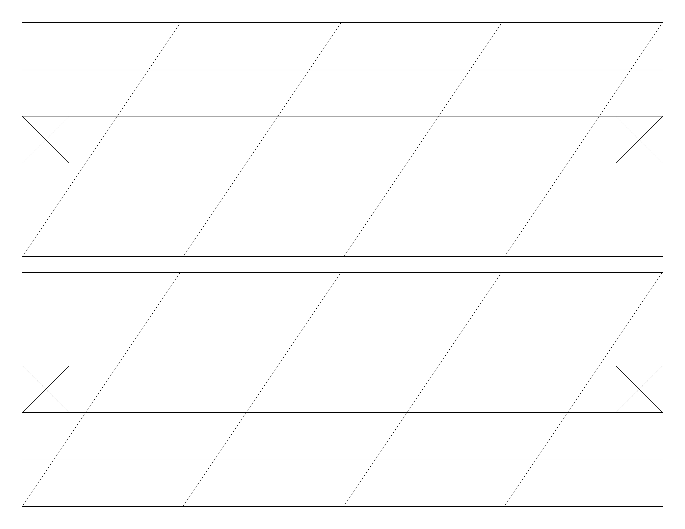

# Typography Guidelines

- 2nd Ascender
- 1st Ascender
- Header
    - X-Height
- Baseline
- 1st Descender
- 2nd Descender

## 8.5" x 8.5", 56º

### 2x

### 3x

### 4x

### 5x

### 6x

## 17" x 11", 56º

### 2x

### 3x

### 4x

### 5x

### 6x

